# 内存管理

## 硬件支持

MMU + TLB + 虚拟页表机制

## 地址空间

物理地址：用于内存芯片级的单元寻址，与处理器和CPU连接的地址总线相对应

逻辑地址：CPU执行机器指令时，用来指定一个操作数或者是一条指令的地址，也是用户编程时使用的地址

## 重定位

逻辑地址（虚拟地址）到物理地址的映射

基地址保存在该进程的PCB中

切换进程就是切换PCB，切换PCB时基地址寄存器一起切换

物理地址 = 基地址 + 逻辑地址（偏移量）

- 编译重定位：不灵活，适用于嵌入式系统
- 载入重定位：灵活性稍有改进，更换地址需要重新载入
- 运行重定位：执行指令时从当前PCB中取基地址进行地址翻译，大多数通用操作系统使用

## 内存分配

- 连续内存分配：内存分区
- 非连续内存分配：内存分段，内存分页

### 内存分区

操作系统会占据内存中的某些固定部分

#### 固定分区

把内存分为若干边界固定的区域

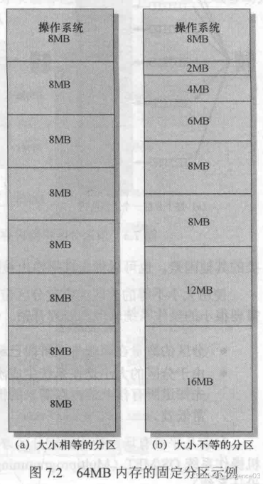

每个分区内可能有大量浪费

#### 动态分区

给每个进程分配**与其大小完全相同**的内存大小

分区内地址是连续的

释放分区时检查是否可与附近空闲块合并

- 最先匹配First Fit：找到能装下进程的内存块就分配 	
- 简单，高地址大块空闲 		
    - 高地址空闲也不一定是好事：后来者要逐个检查
    
  - 产生外碎片

- 下次匹配Next Fit：从上次放置的位置开始扫描内存，找到能装下进程的内存块就分配

- 最佳匹配Best Fit：寻找与进程大小差距最小的空闲内存块
- 适合申请分配**尺寸较小**的情形
  - 释放时速度较慢
  - 如果采用有序链表组织空闲块，释放后得到的空闲块需要遍历寻找链中位置
  - 产生外碎片，且会**产生大量无用的小碎片**

- 最差匹配Worst Fit：寻找与进程大小差距最大的空闲内存块
  - 适合申请分配**尺寸中等**的情形
  - 产生外碎片，但可以**有效避免小碎片**
  - 释放时速度较慢
  - 容易破坏大的空闲块

#### 内存碎片

- 外部碎片：**分配单元之间**未被使用的内存
- 内部碎片：**分配单元内**未被使用的内存

内存紧缩：移动已分配段，将空闲分区合并，减少外部碎片

- 需要所有的进程支持动态重定位
- 时间成本很高

#### 伙伴系统Buddy

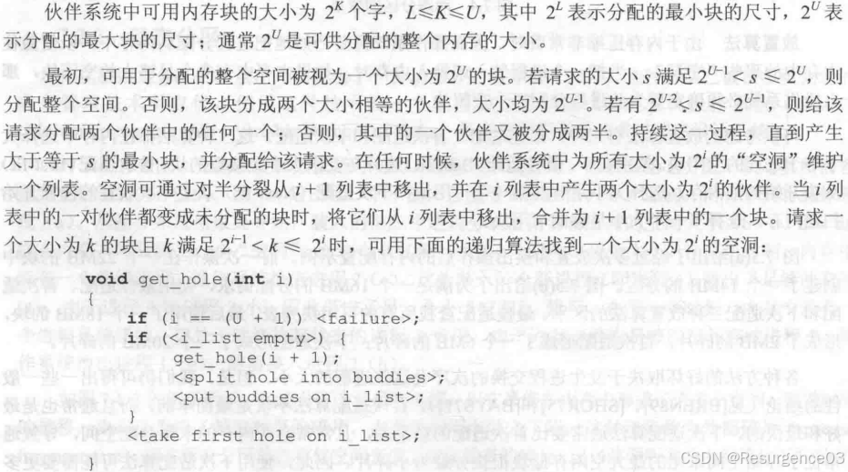

- 分配时拆整块

- 释放时空闲块之前怎么拆的现在就怎么合并

  - 即使它们相邻，但是不来自于同一个更高一级的地址块，也不能合并
  - 更为定量的合并条件
    - 大小相同，为$2^k$位块
    - 地址相邻
    - 低地址空闲块起始地址为$2^{k+1}$的倍数

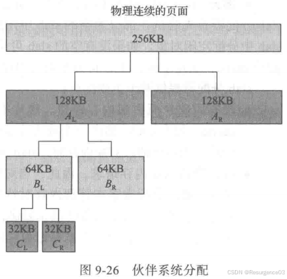

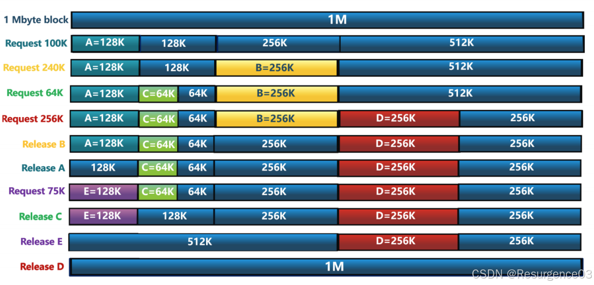

### 内存分段

对应程序员视角下汇编中对汇编代码的分段，内存中将程序按存储数据特征分为若干个段

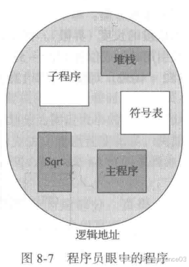

静态内存分配：编译时分配的内存，如全局变量

动态内存分配：运行时分配的内存，如局部变量、类实例、动态数组

- 编译时不知道需要多大的内存，如`int* arr = new int[n];`
- 在栈和堆中 
  - 栈存放基本数据类型
  - 堆存放以指针形式显式malloc()或new的变量

#### 段表

采用上面的处理，PCB中要存放每段程序所对应的基地址：二维虚拟地址映射为物理地址

- 段基地址
- 段界限：段的长度

逻辑地址 = 段号 || 段内偏移

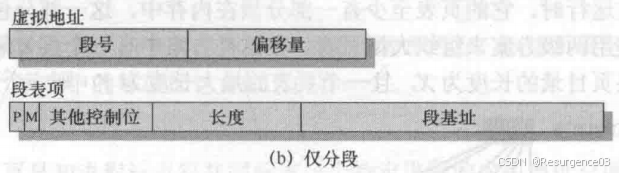

逻辑地址翻译为物理地址

逻辑地址仅对该进程有效，最左侧的n位指明了所寻地址在当前进程页表的第几段中

段表基地址寄存器STBR：给出段表第0条的地址

- 切换进程时的切换段表只需要修改STBR即可

段表索引是连续的（没有理由变成不连续的，反正后续需要翻译）

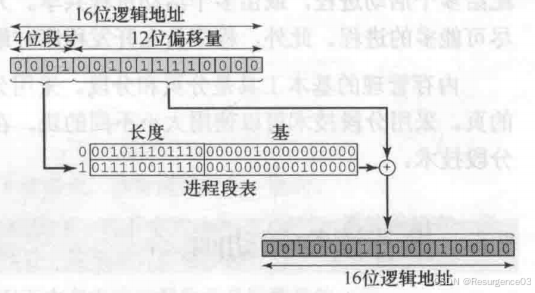

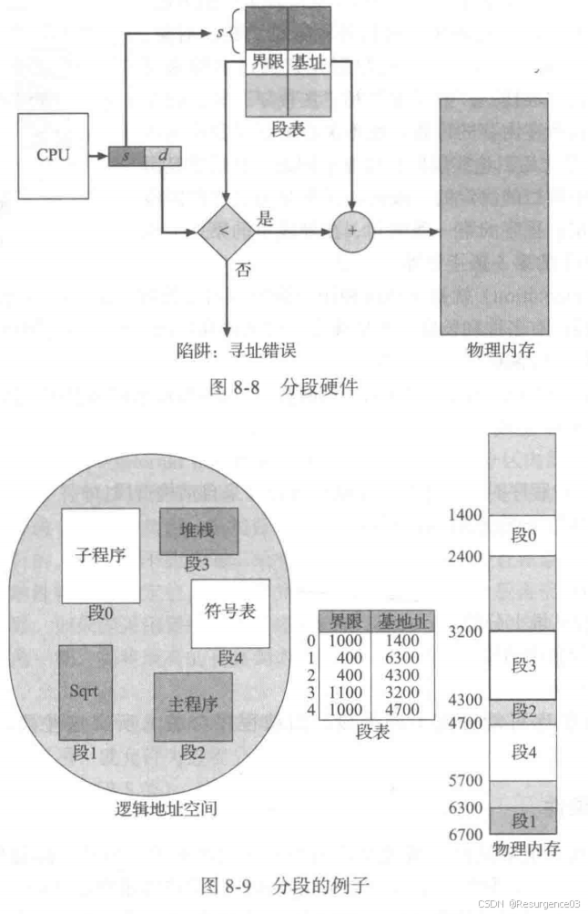

段描述符：程序员用来标记各个段的记号，操作系统视角下就是段号

- 操作系统有GDT（Global Descriptor Table） 
  - 存放所有LDT
- 每个进程有自己的LDT（Local Descriptor Table） 
  - 存放自身的映射关系
  - 切换进程时也需要切换当前的LDT

### 内存分页

将内存分成页，给刚好够用的内存页

- 每个进程最多浪费一页大小的内存

把物理内存划分为若干个大小相同的页框，把逻辑内存对应地划分为若干个页

每个页框的大小 = 每页大小

#### 页表

采用上面的处理，PCB中要存放每页程序所在的页框：二维虚拟地址映射为物理地址

- 页框号：该页所在物理内存的页框号

**页表大小与虚拟地址大小成正比**

- 进程的每一页都有对应的页表项，无论这一页是否真的被使用
- n位页号→页表有$2^n$个页表项 
  - 页表索引是连续的

逻辑地址 = 页号 || 页内偏移

##### 页表项

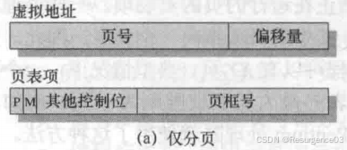

- P：**存在位**，该页在内存中
- M：**修改位**，该页换出时是否更新（脏位）
- 锁定标志位：该页**常驻内存**，不能被换出

**页表必须在内存中**

页表基地址寄存器PTBR：给出页表第0条的地址

- 切换进程时的切换页表只需要修改PTBR即可

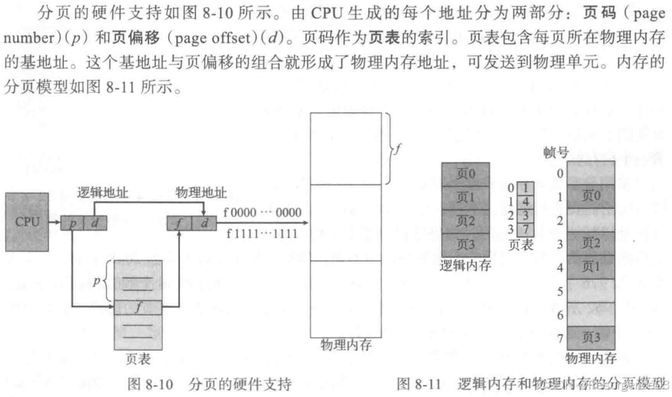

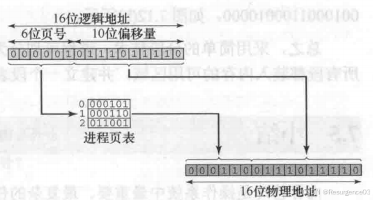

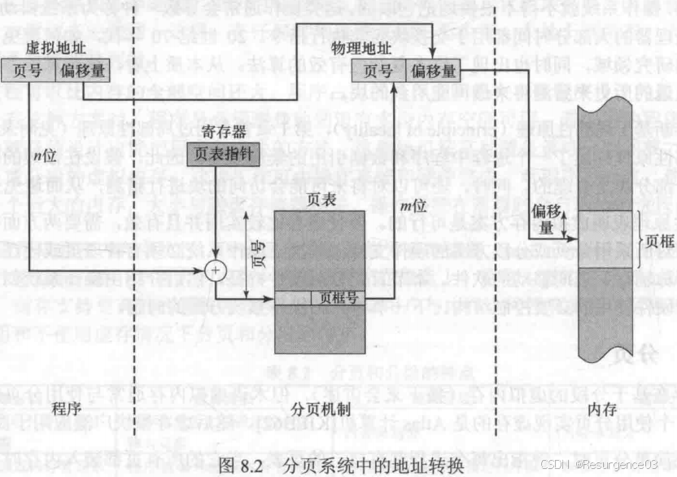

- 访存时间变大：需要两次映射
- 页表本身存储成本可能很大
  - 单页小，页表项就多
  - 单页大，内存浪费就多

#### 快表TLB（Translation Look-aside Buffer）

是**相联存储器**，按内容访问，采用电路实现同时比对的快速访问

- 逻辑地址用页号访问快表 
  - 按页号相联比对
- 快表中有对应页号，直接获取对应页框号
- 反之，找内存更新页表项

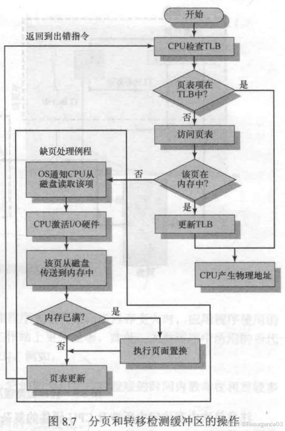

跨上下文的TLB处理

- 一旦硬件层面上PTBR发生改变（意味着页表切换，即**进程切换**） 	

  - 清空TLB
  - 操作成本很高
  
- 增加地址空间标识符ASID标记不同进程

#### 多级页表

如同章目录与节目录一样

**低级页表的页表项指向一张高级页表**

逻辑地址 = 一级页号 || 二级页号 || ... || 页内偏移

- 逻辑地址取一级页号，找一级页表中对应的二级页表的页表基地址
- 逻辑地址取二级页号，找二级页表中对应的三级页表的页表基地址
- 以此类推
- 在最后一级页表中找到对应的页框，拼接为物理地址

**一级页表必须在内存中**

（一般二级页表占一个页面）

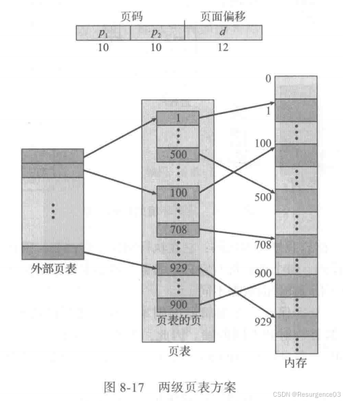

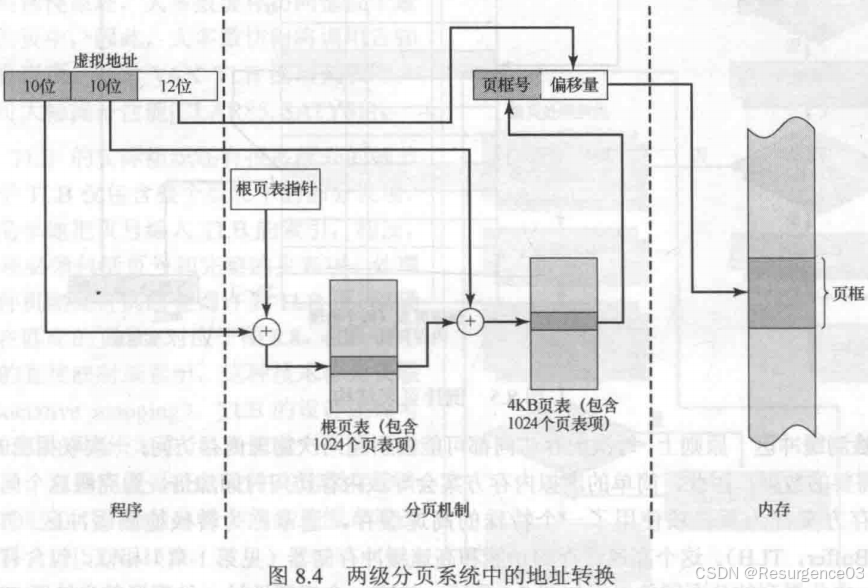

#### 倒置页表

**倒置页表大小与物理地址大小成正比**

- 对于每个页框，倒置页表中有一个对应页表项
- n位页框号→倒置页表有$2^n$个页表项
  - 倒置页表索引是连续的
  - 页框号可以随机访问
- 页号通过hash映射为页框号
  - 页框号 = hash(页号 (|| PID))
  - if(页表项页号 == 页号 && 页表项PID == 当前PID)
    - 找到
  - else
    - hash冲突
    - 循链指针向下寻找匹配者

##### 倒置页表项

| 页号 | PID  | 控制位 | hash冲突页表项指针 |
| :--: | :--: | :----: | :----------------: |

- 链指针用于处理hash冲突，指向下一个查找项

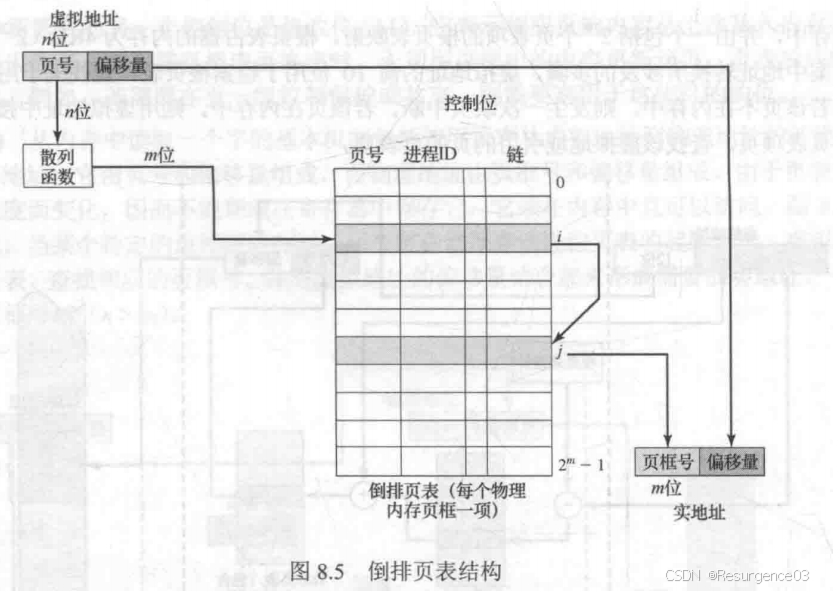

- 所有进程共享一个倒置页表，节省空间
- 不需要多次映射，简化管理
- 需要额外的哈希和冲突处理结构，实现复杂

#### 共享页

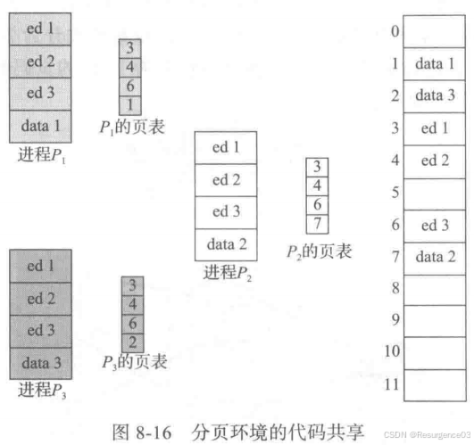

### 段页式存储管理

逻辑地址 = 段号 || 页号 || 页内偏移

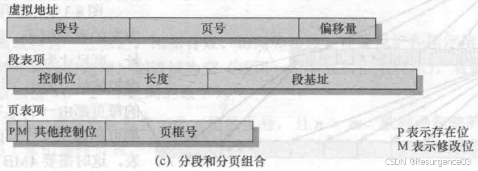

- 程序分割为若干段
- 段表项指向页号 
  - 每个段使用一张页表
- 页映射为页框

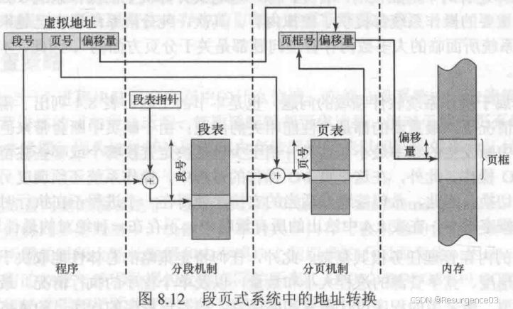

## 虚拟存储

大容量外存与内存调入调出实现大容量存储

操作系统将不常用的内存内容暂存到外存，把要使用的外存内容转入内存

### 覆盖技术

程序员手动控制在小空间内执行大程序

- 在不同时间段内在同一块内存上执行函数或模块

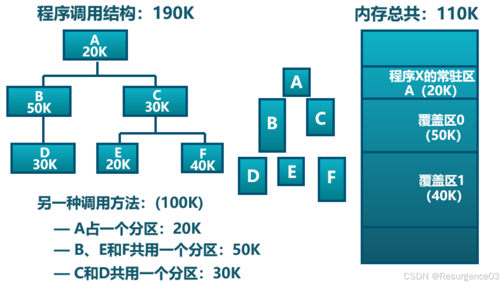

- 增加编程困难
  - 还要考虑覆盖问题
- 增加执行时间
  - 装入覆盖内存需要时间

### 交换技术

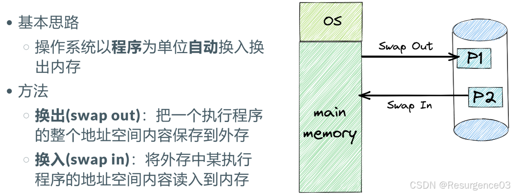

### 虚拟页式存储管理

内存分页+请求调页+页面置换

#### 缺页异常

在页表中增加有效/无效位

- 有效：当前项页框在内存中
- 无效：当前项页框在外存中
  - 页表项的页框号给出该页在磁盘上的起始位置

一旦进程试图访问无效位标记的页表项，即产生缺页**异常**

- **是异常而非中断**
- cache缺失由硬件层面处理

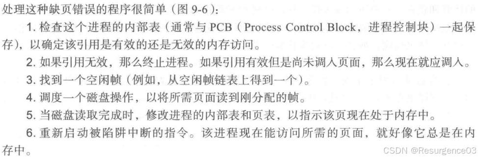

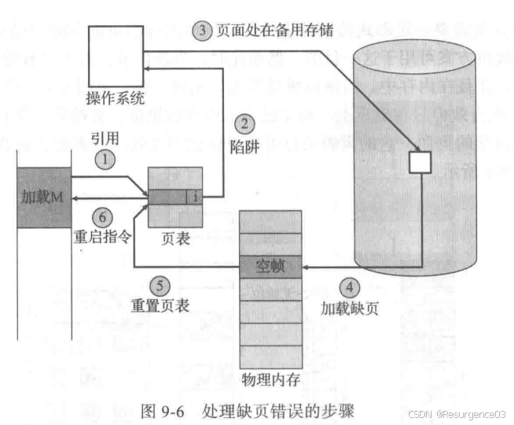

#### 请求调页

命中访问+处理缺页异常

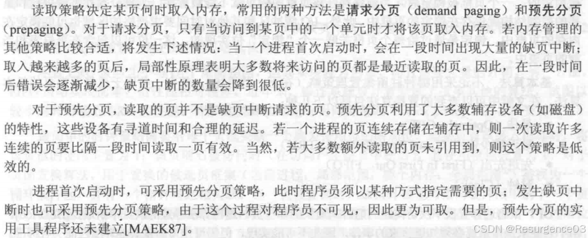

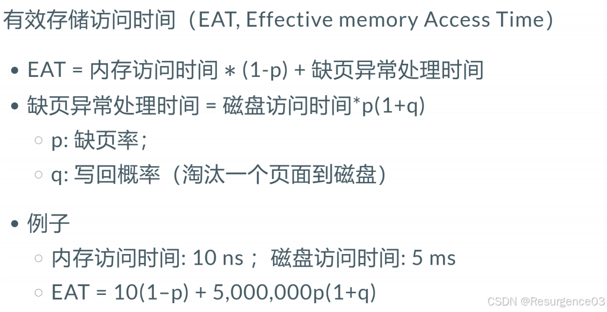

#### 页面置换算法

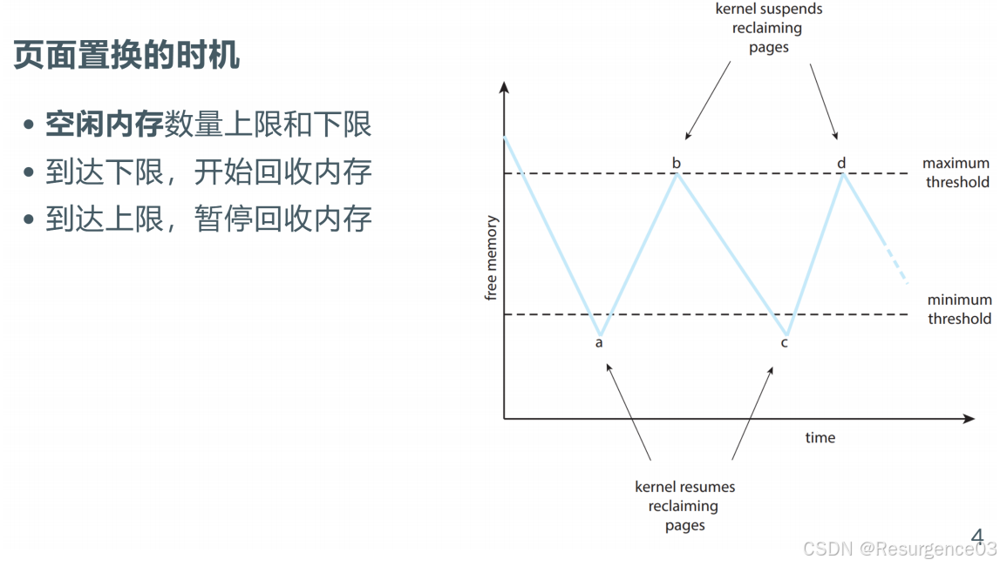

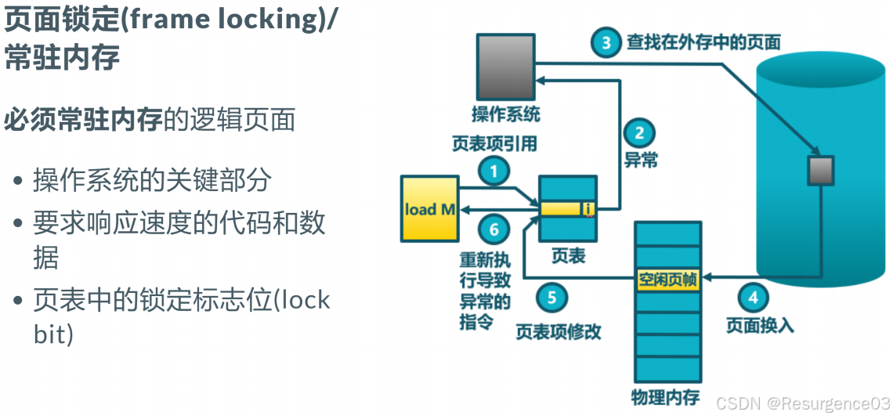

##### 局部页面置换算法

置换页面的选择范围只在**当前进程**占用的页框内

###### 最优（OPT）置换算法

换出在未来最长时间不访问的页面

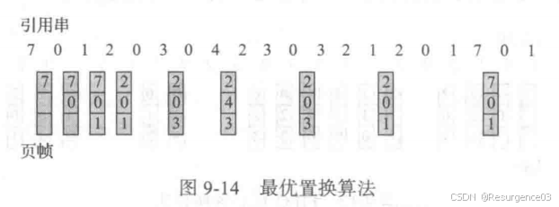

- 理想情况下是缺页最少的策略
- 实际无法实现

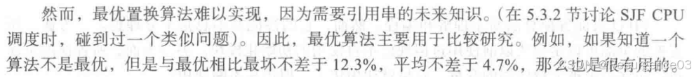

###### 先进先出（FIFO）算法

换出在内存中存在时间最长的页面

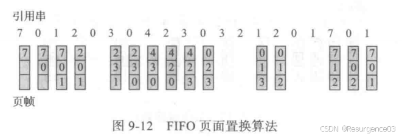

- 内存中所有页成一队列
- 缺页时dequeue()，新页enqueue()

特征：

- 实现简单
- 性能很差
- Belady现象
- 很少单独使用

###### 最近最久未使用（LRU，Least-Recent-Used）算法

换出**最长时间没有使用**的页面

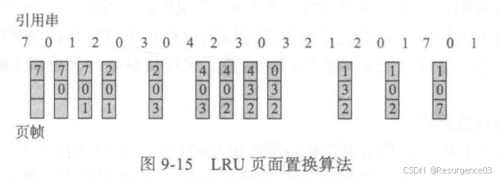

如果页进入内存后从未被访问，LRU退化为FIFO

###### 时钟置换算法（第二次机会算法）

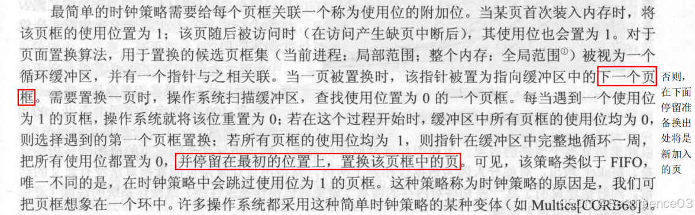

**当所有页框的使用位均为1时**，退化为FIFO

- 初始情况下即为FIFO，一轮循环后使用位均置0

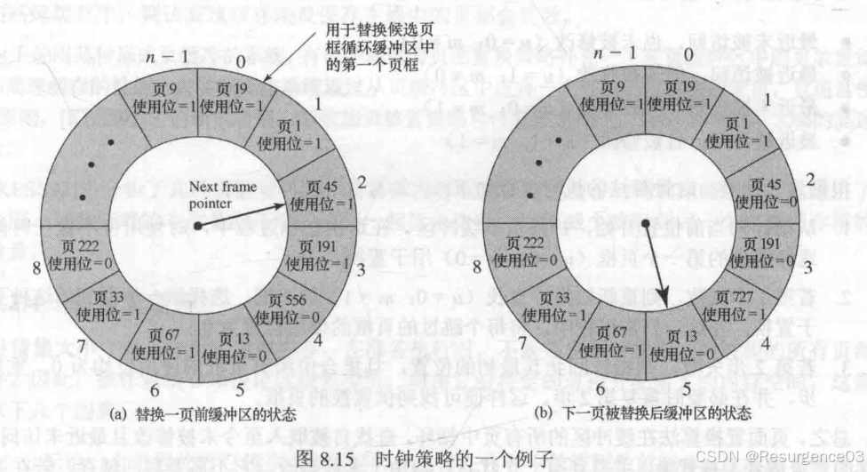

###### 改进时钟置换算法（改进第二次机会算法）

**针对I/O的改进**

引入修改位，修改过的页降低置换优先级，减少I/O

改进的CLOCK算法可能有更高的缺页率

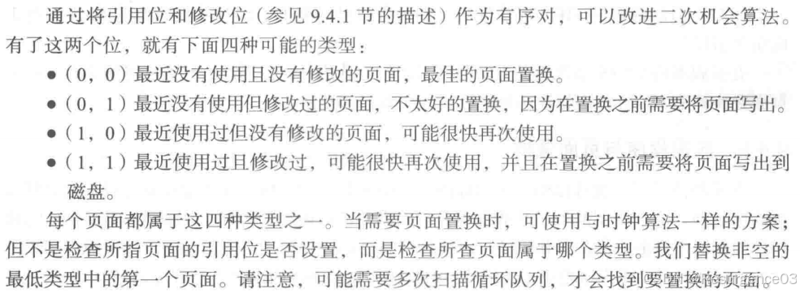

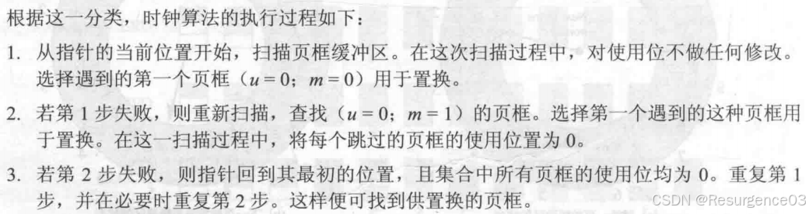

###### 最不常用（LFU，Least-Frequent-Used）算法

换出**访问次数最少**的页面

记录每个页面**被访问的次数**

###### Belady现象

**进程占用内存增加**，但**缺页发生次数反而升高**

**证明没有Belady现象：页面扩大后任一原页仍在内存中**

- OPT**没有**Belady现象（属于堆栈算法） 	

  - 考虑$n$个物理页面的情形，其包含1个最近访问的页面+未来一段时间$t_1$内将访问的不同$n-1$个页的集合$S_1$，$t_1$为访问第$n$个不同页面的时间（即当前时刻下页表内物理页均访问过的时间）
  - 若有$n+1$个物理页面，$t_2$为访问第$n+1$个不同页面的时间，显然大于$t_1$，剩下的$n$个页的集合$S_2$也应包含$S_1$
  
- FIFO有Belady现象

  - 访存序列123412512345，考虑3页和4页

- LRU**没有**Belady现象（属于堆栈算法） 

  - 如果内存页的集合为最近引用的n页，尽管页框增加，这n页仍然是最近引用的页，所以也仍然在内存中，所以对于页框数为n的内存页集合是对于页框数为n+1的内存页集合的子集

- （改进）时钟置换有Belady现象

  - 访存序列123412512345，考虑3页和4页

- LFU有Belady现象

  - 考虑访存序列{0, 0, 0, 1, 1, 2, 2, 1, 1, 2, 2, | 3, 0, 3, 0, ...}，物理页分别有2页和3页

  - 前11个请求处理后 	

    |      | 物理页A | 物理页B | 物理页C |
    | :--: | :-----: | :-----: | :-----: |
    | 2页  | 0（3）  | 2（2）  |    /    |
    | 3页  | 0（3）  | 1（4）  | 2（4）  |

  - {3, 0, 3, 0, ...}将导致2页情形只缺页一次，3页方案永远缺页

- 不清空计数的LFU**没有**Belady现象

  - 如果内存页的集合为最近引用的n页，尽管页框增加，这n页仍然是最近引用的页，所以也仍然在内存中，所以对于页框数为n的内存页集合是对于页框数为n+1的内存页集合的子集

##### 全局页面置换算法

置换页面的选择范围是**所有进程**占用的页框内

为每个进程分配可变数量的页框

###### 工作集页面置换算法

**工作集**

进程当前正在使用的页集合

- 其大小只取决于进程本身（进程执行过程需要的页）

- 进程开始执行后，随着访问新页面逐步建立较稳定的工作集
- 当内存访问的局部性区域位置大致稳定时，工作集大小也大致稳定
- 局部性区域位置改变时，工作集快速扩张和收缩过渡到下一个稳定值

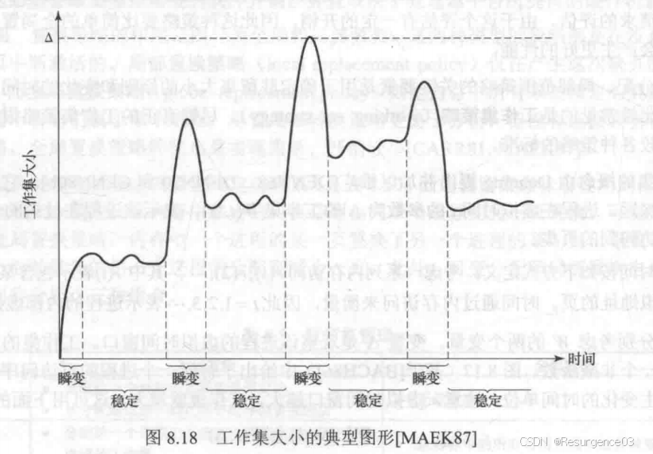

**算法**

换出不在工作集中的页面

- 可能出现页面越来越少的情形

###### 缺页率页面置换算法

**常驻集**

当前时刻单个进程在内存中的页数量

- 取决于OS分配给进程的可用页框数和采用的页面置换算法

缺页率 = 缺页次数 / 内存访问次数 = 1 / 缺页平均时间间隔

- OS分配给进程的可用页框数
- 页面置换算法
- 页大小
- 程序设计风格

调整常驻集大小的目的

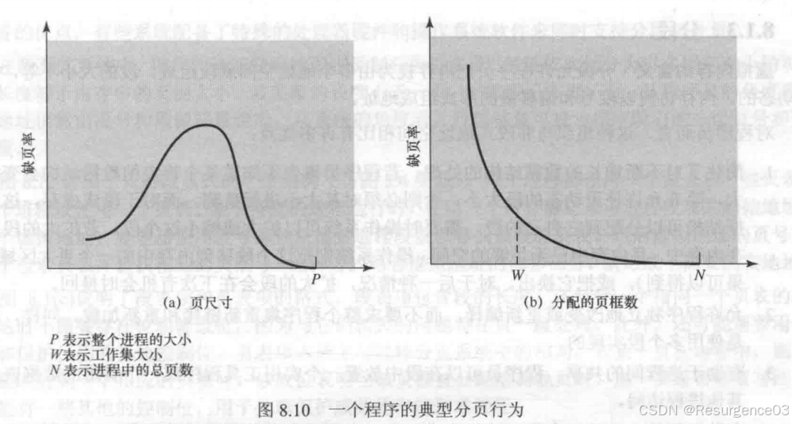

- 缺页率高就增大常驻集大小
- 缺页率低就减小常驻集大小

**算法**

记容忍阈值为$T$

- 访存时置引用位为1

- 出现缺页时，检查与上次缺页的时间间隔$\Delta t$

  - 如果$\Delta t > T$，表明给的页框没有好好利用，换出所有在时间间隔（闭区间）内**没有访问**的页

    - 置引用位为0
    - 上次缺页时调入的页一定保留
    
  - 如果$\Delta t \le T$，表明页框比较充足，把页调入常驻集

**系统抖动**

进程持有的页框太少，不能包含工作集，执行中产生大量缺页，频繁执行置换

如果进程的调页时间大于执行时间，那么进程处于抖动