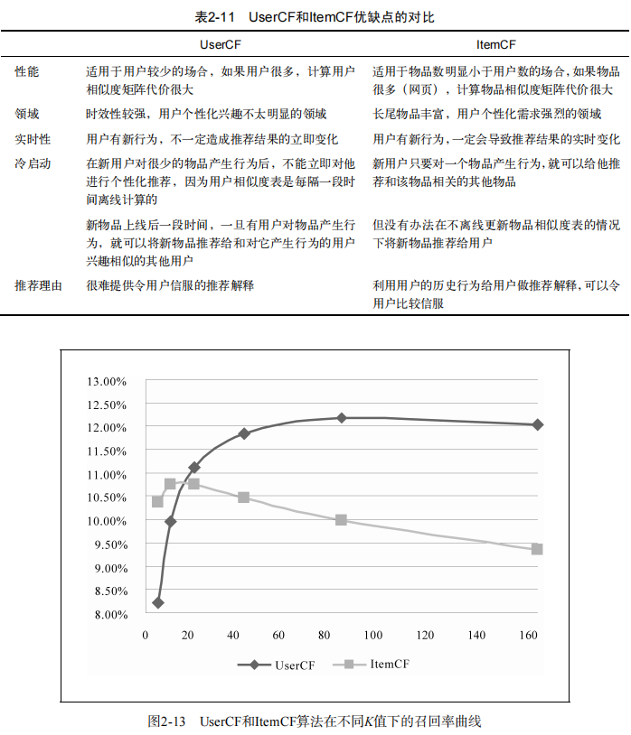
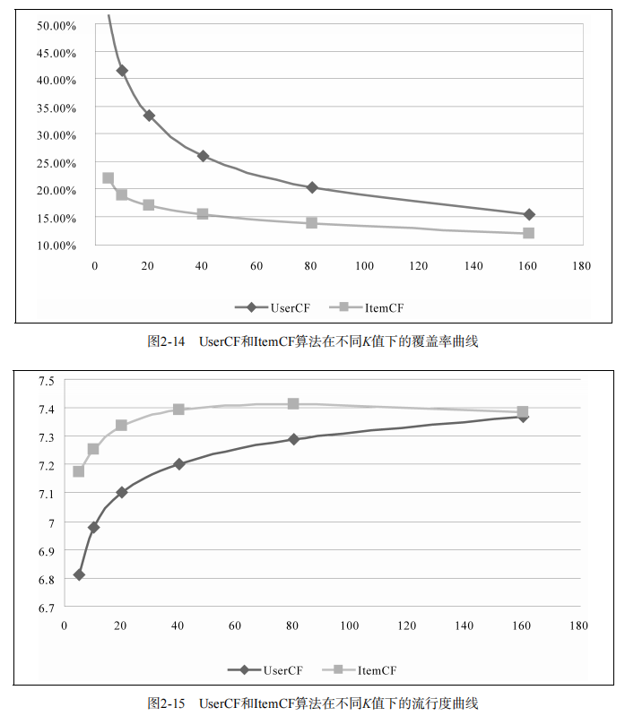
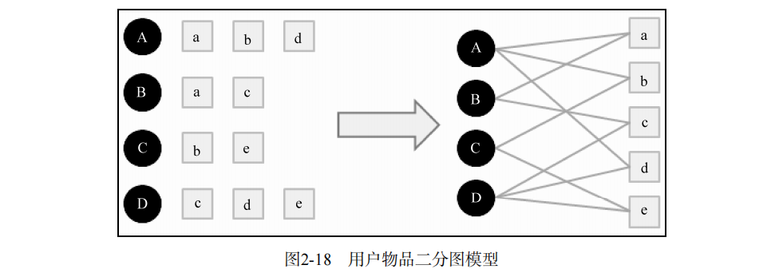

## 第2章 利用用户行为数据

基于用户行为分析的推荐算法是个性化推荐系统的重要算法，学术界一般将这种类型的算法称为协同过滤算法。

### 2.1 用户行为数据

按照反馈的明确性

- 显性反馈行为（explicit feedback）：用户明确表示对物品喜好的行为
	- 5分评分系统和两档评分系统
- 隐性反馈行为（implicit feedback）：不能明确反应用户喜好的行为
	- 页面浏览行为

------

按照反馈的方向

- 正反馈：用户的行为倾向于指用户喜欢该物品
- 负反馈：用户的行为倾向于指用户不喜欢该物品

------

|          | 显性反馈数据 |  隐性反馈数据  |
| :------: | :----------: | :------------: |
| 用户兴趣 |     明确     |     不明确     |
|   数量   |     较少     |      庞大      |
|   存储   |    数据库    | 分布式文件系统 |
| 实时读取 |     实时     |     有延迟     |
| 正负反馈 |     都有     |     ？^*^      |

^*^ 原书此处为 只有正反馈

------

用户行为的统一表示

- `user id`：产生行为的用户的唯一标识
- `item id`：产生行为的对象的唯一标识
- `behavior type`：行为的种类（比如是购买还是浏览）
- `context`：产生行为的上下文，包括时间和地点等
- `behavior weight`：行为的权重（如果是观看视频的行为，那么这个权重可以是观看时长；如果是打分行为，这个权重可以是分数）
- `behavior content`：行为的内容（如果是评论行为，那么就是评论的文本；如果是打标签的行为，就是标签）

有些时候可能会忽略一些信息（比如上下文），有些信息是不能忽略的，比如产生行为的用户和行为的对象就是所有行为都必须包含的。

按数据集包含的信息分类

- **无上下文信息的隐性反馈数据集**：每一条行为记录仅仅包含用户ID和物品ID。
- **无上下文信息的显性反馈数据集**：每一条记录包含用户ID、物品ID和用户对物品的评分。
- **有上下文信息的隐性反馈数据集**：每一条记录包含用户ID、物品ID和用户对物品产生行为的时间戳。
- **有上下文信息的显性反馈数据集**：每一条记录包含用户ID、物品ID、用户对物品的评分和评分行为发生的时间戳。

### 2.2 用户行为分析

令$f_u(k)$为对$k$个物品产生过行为的用户数，令$f_i(k)$为被$k$个用户产生过行为的物品数。那么，$f_u(k)$和$f_i(k)$都满足长尾分布，即
$$
f_i(k) = \alpha_i k^{\beta_i} \\
f_u(k) = \alpha_u k^{\beta_u}
$$
用户越活跃，越倾向于浏览冷门的物品。

仅仅基于用户行为数据设计的推荐算法一般称为协同过滤算法。

- 基于邻域的方法（neighborhood-based）
	- 基于用户的协同过滤算法：这种算法给用户推荐和他兴趣相似的其他用户喜欢的物品。
	- 基于物品的协同过滤算法：这种算法给用户推荐和他之前喜欢的物品相似的物品。
- 隐语义模型（latent factor model）
- 基于图的随机游走算法（random walk on graph）

### 2.3 实验设计和算法评测

略

### 2.4 基于邻域的算法

#### 基于用户的协同过滤算法（UserCF）

1. 找到和目标用户兴趣相似的用户集合。
	- 计算两个用户的兴趣相似度（填充用户兴趣相似度矩阵）
		- 主要利用行为的相似度
		- 给定用户$u$和用户$v$，令$N(u)$表示用户$u$曾经有过正反馈的物品集合，令$N(v)$为用户$v$曾经有过正反馈的物品集合
		- Jaccard公式：$w_{uv} = \dfrac{\left| N(u) \cap N(v) \right|}{\left| N(u) \cup N(v) \right|}$
		- 余弦相似度：$w_{uv} = \dfrac{\left| N(u) \cap N(v) \right|}{\sqrt{\left| N(u) \right| \left| N(v) \right|}}$

	- 从物品出发建立物品到用户的倒排表可减小复杂度
	- （John S. Breese，1998）两个用户对冷门物品采取过同样的行为更能说明他们兴趣的相似度
		- 添加IIF（Inverse Item Frequency）项：$w_{uv} = \dfrac{\displaystyle \sum_{i \in N(u) \cap N(v)} \dfrac{1}{\log (1 + \left| N(i) \right|)}}{\sqrt{\left| N(u) \right| \left| N(v) \right|}}$

2. 找到这个集合中的用户喜欢的，且目标用户没有听说过的物品推荐给目标用户。
	- 给用户推荐和他兴趣最相似的$K$个用户喜欢的物品
	- 用户$u$对物品$i$的感兴趣程度：$\displaystyle p(u,i) = \sum_{v \in S(u,K) \cap N(i)} w_{uv} r_{vi}$​，其中$S(u, K)$包含和用户$u$兴趣最接近的$K$个用户，$N(i)$是对物品$i$有过行为的用户集合，$w_{uv}$是用户$u$和用户$v$的兴趣相似度，$r_{vi}$代表用户$v$对物品$i$的兴趣
		- 如果使用无上下文信息的隐性反馈数据集，$r_{vi} = 1$

#### 基于物品的协同过滤算法（ItemCF）

1. 计算物品之间的相似度。（填充相似度矩阵）
	- $w_{ij} = \dfrac{\left| N(i) \cap N(j) \right|}{\left| N(i) \right|}$
		- 喜欢物品$i$的用户中有多少比例的用户也喜欢物品$j$
	- 带物品$j$马太效应惩罚的物品相似度：$w_{ij} = \dfrac{\left| N(i) \cap N(j) \right|}{\sqrt{\left| N(i) \right| \left| N(j) \right|}}$
	- 从用户出发建立用户到物品的倒排表可减小复杂度
	- （John S. Breese，1998）活跃用户对物品相似度的贡献应该小于不活跃的用户
		- 添加IUF（Inverse User Frequency）项：$w_{ij} = \dfrac{\displaystyle \sum_{u \in N(i) \cap N(j)} \dfrac{1}{\log (1 + \left| N(u) \right|)}}{\sqrt{\left| N(i) \right| \left| N(j) \right|}}$
	- （Karypis）如果将ItemCF的相似度矩阵按最大值归一化，可以提高推荐的准确率。
2. 根据物品的相似度和用户的历史行为给用户生成推荐列表。
	- 用户$u$对物品$j$的感兴趣程度：$\displaystyle p_{uj} = \sum_{j \in S(j,K) \cap N(u)} w_{ji} r_{ui}$，其中$N(u)$是用户喜欢的物品的集合，$S(j,K)$是和物品$j$最相似的$K$个物品的集合，$w_{ji}$是物品$j$和$i$的相似度，$r_{ui}$是用户$u$对物品$i$的兴趣

#### UserCF和ItemCF的综合比较

### 2.5 隐语义模型

通过隐含特征（latent factor）联系用户兴趣和物品

隐语义模型（latent factor model，LFM）

隐含语义分析技术（latent variable analysis）

用户$u$对物品$i$的兴趣
$$
Preference(u,i)=r_{ui}=p_u^\mathrm{T} q_i = \sum_{f=1}^F p_{u,k} q_{i,k}
$$
其中 $p_{uk}$度量了用户$u$的兴趣和第$k$个隐类的关系，$q_{ik}$度量了第$k$个隐类和物品$i$之间的关系。

隐性反馈数据集上的负样本采样

LFM模型很难实现实时的推荐，冷启动问题非常明显

LFM vs 基于邻域的方法

- 理论基础：LFM具有比较好的理论基础
- 离线计算的空间复杂度：LFM大量节省了训练过程中的内存
- 离线计算的时间复杂度：两种算法在时间复杂度上没有质的差别
- 在线实时推荐：LFM不能进行在线实时推荐；UserCF和ItemCF在线服务算法需要将相关表缓存在内存中，然后可以在线进行实时的预测
- 推荐解释：ItemCF算法支持很好的推荐解释，它可以利用用户的历史行为解释推荐结果；LFM无法提供这样的解释

### 2.6 基于图的模型

#### 用户行为数据的二分图表示

#### 基于图的推荐算法

归约为图中顶点之间相关性问题

基于随机游走的PersonalRank算法

假设要给用户$u$进行个性化推荐，可以从用户$u$对应的节点$v_u$开始在用户物品二分图上进行随机游走。

游走到任何一个节点时，首先按照概率$\alpha$决定是继续游走，还是停止这次游走并从$v_u$节点开始重新游走。如果决定继续游走，那么就从当前节点指向的节点中按照均匀分布随机选择一个节点作为游走下次经过的节点。这样，经过很多次随机游走后，每个物品节点被访问到的概率会收敛到一个数。最终的推荐列表中物品的权重就是物品节点的访问概率。

上述收敛值满足下述线性方程组
$$
\mathrm{PR}(v) =
\begin{cases}
	\alpha \displaystyle\sum_{v' \in \mathrm{in}(v)} \dfrac{\mathrm{PR}(v')}{\left| \mathrm{out}(v')\right|}, \quad v \neq v_u \\\\
	(1 - \alpha) + \alpha \displaystyle\sum_{v' \in \mathrm{in}(v)} \dfrac{\mathrm{PR}(v')}{\left| \mathrm{out}(v')\right|}, \quad v = v_u
\end{cases}
$$
迭代直到PR值收敛时间复杂度非常高

- 减少迭代次数

- 稀疏求逆

	令$M$为用户物品二分图的转移概率矩阵，即$M(v,v') = \dfrac{1}{\left| \mathrm{out}(v) \right|}$，那么对于全局PR值向量$r$，有线性方程组$r = (1- \alpha) r_0 + \alpha M^\mathrm{T} r$，$r = (1 - \alpha)(1 - \alpha M^\mathrm{T})^{-1} r_0$
